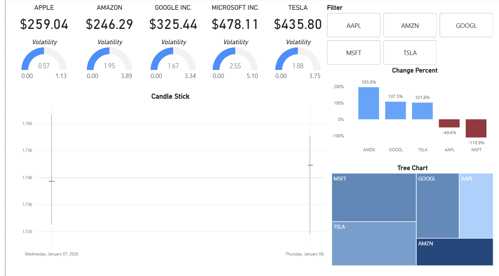
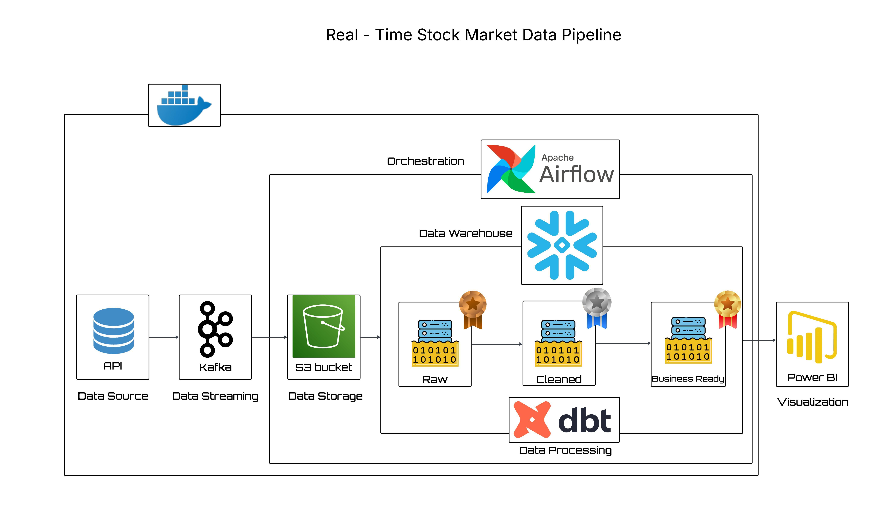

# 📈 Real-Time Stock Market Data Pipeline

**End-to-End Streaming Analytics using the Modern Data Stack**

Snowflake · dbt · Apache Airflow · Apache Kafka · Python · Docker · Power BI

---

## 📌 Project Overview

This project showcases a **production-style, real-time stock market data pipeline** built using the Modern Data Stack.

Live stock prices are fetched from an external API, streamed in real time through Kafka, orchestrated with Airflow, transformed using dbt inside Snowflake, and finally served to **analytics-ready Power BI dashboards**.

The goal of this project is to demonstrate **real-world data engineering skills**, including streaming ingestion, layered data modeling (Bronze/Silver/Gold), orchestration, and business-focused analytics.



---

## 🏗️ Architecture

**High-level flow:**

API → Kafka Producer → Kafka Topic → Kafka Consumer → MinIO (Raw/Bronze) → Airflow → Snowflake → dbt Models → Power BI

This architecture closely mirrors how modern data platforms handle **near real-time analytics at scale**.



---

## ⚡ Tech Stack

* **Snowflake** – Cloud data warehouse for scalable analytics
* **dbt** – SQL-based transformations and analytics engineering
* **Apache Airflow** – Workflow orchestration and scheduling
* **Apache Kafka** – Real-time data streaming
* **Python** – API ingestion, producers, consumers, utilities
* **Docker** – Containerized local development environment
* **Power BI** – Business intelligence and visualization

---

## ✅ Key Features

* Fetches **live stock market data** from a real external API (not simulated)
* Real-time streaming using Apache Kafka
* Layered data modeling (Bronze → Silver → Gold)
* Orchestrated ingestion and transformations with Airflow
* Scalable Snowflake warehouse design
* dbt models built with analytics best practices
* Power BI dashboards powered by real-time warehouse data

---

## 📂 Repository Structure

```
real-time-stocks-data-pipeline/
├── producer/                     # Kafka producer (API → Kafka)
│   └── producer.py
├── consumer/                     # Kafka consumer (Kafka → MinIO)
│   └── consumer.py
├── dbt_stocks/                   # dbt project
│   └── models/
│       ├── bronze/
│       │   ├── bronze_stg_stock_quotes.sql
│       │   └── sources.yml
│       ├── silver/
│       │   └── silver_clean_stock_quotes.sql
│       └── gold/
│           ├── gold_candlestick.sql
│           ├── gold_kpi.sql
│           └── gold_treechart.sql
├── dags/                         # Airflow DAGs
│   └── minio_to_snowflake.py
├── docker-compose.yml            # Kafka, Zookeeper, MinIO, Airflow, Postgres
├── requirements.txt
└── README.md
```

---

## 🚀 Getting Started

1. Clone the repository
2. Configure environment variables (API keys, Snowflake credentials)
3. Start services using Docker Compose
4. Run the Kafka producer to fetch live stock data
5. Airflow orchestrates ingestion into Snowflake
6. dbt applies transformations
7. Connect Power BI to Snowflake for visualization

---

## ⚙️ Step-by-Step Implementation

### 1️⃣ Kafka Setup

* Apache Kafka and Zookeeper are configured using Docker
* A dedicated topic is created for streaming stock market events
* Producers publish live market data; consumers process and persist it

---

### 2️⃣ Live Stock Data Producer

* Python-based Kafka producer fetches live stock prices from an external API
* Data is streamed in JSON format at near real-time intervals
* Designed to handle schema changes and API fluctuations

---

### 3️⃣ Kafka Consumer → MinIO

* Python consumer reads messages from Kafka
* Data is written to **MinIO (S3-compatible storage)**
* Raw data is organized for Bronze-layer ingestion

---

### 4️⃣ Airflow Orchestration

* Apache Airflow runs inside Docker
* DAG responsibilities:

  * Load data from MinIO into Snowflake staging tables
  * Schedule ingestion jobs at frequent intervals
  * Monitor pipeline health and failures

---

### 5️⃣ Snowflake Warehouse Setup

* Snowflake database and schemas created for analytics
* Layered architecture implemented:

  * **Bronze** – Raw structured data
  * **Silver** – Cleaned and validated data
  * **Gold** – Business-ready analytical models

---

### 6️⃣ dbt Transformations

* dbt project configured with Snowflake adapter
* Models include:

  * Bronze models for structured ingestion
  * Silver models for data quality and normalization
  * Gold models for analytics and reporting
* Follows dbt best practices: modular SQL, clear naming, and testability

---

### 7️⃣ Power BI Dashboard

* Power BI connects directly to Snowflake (Gold layer)
* Dashboards include:

  * Candlestick charts for price movement
  * Tree maps for comparative trends
  * KPI cards for real-time metrics
  * Volume and performance indicators

---

## 📊 Final Deliverables

* Fully automated real-time data pipeline
* Snowflake warehouse with Bronze/Silver/Gold layers
* dbt analytics models
* Airflow DAGs for orchestration
* Power BI dashboards with near real-time insights

---

## 🎯 Why This Project Matters

This project demonstrates:

* Real-world data engineering workflows
* Streaming + batch hybrid architecture
* Analytics engineering using dbt
* Cloud-native warehouse design
* Business-focused visualization

It is designed to closely resemble **production-grade data platforms** used in modern analytics teams.

---

## 👤 Author

**Prince Pastakiya**
Data Engineer | Analytics Engineer

* LinkedIn: [https://www.linkedin.com/in/prince-pastakiya/](https://www.linkedin.com/in/prince-pastakiya/)
* GitHub: [https://github.com/prince-pastakiya](https://github.com/prince-pastakiya)

---

⭐ If you find this project helpful, feel free to star the repository and explore further enhancements!
